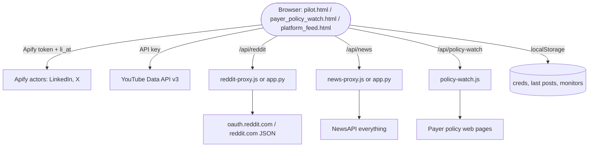

# SLD — Social Listening Dashboard (PainMed-PA)

Multi-source social listening and market-intelligence dashboard built for **PainMed-PA / Probe Practice Solutions**, focused on U.S. interventional pain management. It monitors LinkedIn, Reddit, X/Twitter, YouTube and news for conversations about prior authorization, billing denials, payers (UHC, Aetna, Cigna, Medicare) and procedures (SCS, SI joint fusion, kyphoplasty, Intracept), and turns them into charts, trend signals and a posts feed.

This repository is the **consolidated archive of the whole project**: the latest deployable app at the root, every earlier iteration under `versions/`, and the original design documents under `docs/`.

| | |
|---|---|
| **Live site (v4, Final SLD)** | https://social-listening-dashboard-final-sld.netlify.app |
| **Netlify admin** | https://app.netlify.com/projects/social-listening-dashboard-final-sld |
| **Netlify site ID** | `5a7ac6ab-3581-4fc0-8ba2-d815e53a272f` (published Feb 28 2026) |
| **Earlier GitHub repos** | [sankrantisrikar/Social-listening-Dashboard](https://github.com/sankrantisrikar/Social-listening-Dashboard) (Jan 6 2026, design doc only) · [sankrantisrikar/Social-istening-dashboard](https://github.com/sankrantisrikar/Social-istening-dashboard) (Feb 12 2026, v3 code) |
| **Active period** | Jan 5 – Feb 28 2026 |
| **Collaborator** | Sujith Julakanti (Netlify deploy of the Jan 27 LinkedIn version) |

---

> **Interns, week 1:** [`docs/KICKOFF_THE_IDEA.md`](docs/KICKOFF_THE_IDEA.md) — the idea and what to bring to Friday. Research and sketch first; no code.
>
> **After week 1 (reference):** [`docs/INTERN_PROJECT_BRIEF.md`](docs/INTERN_PROJECT_BRIEF.md) — detailed requirements, target architecture, data model, milestones. Read this only after you have presented your own ideas. **Note (Sep 18 2026):** the brief was written when SLD was framed as market surveillance for practices. The agreed purpose is now lead generation for Raj garu (see the kickoff doc); the brief's architecture and data model still apply, but its personas and goals need revising.

---

## 1. What is at the root (v4.0 "Final SLD", Feb 28 2026)

Pure HTML/CSS/JS (no build step) plus optional Python or Netlify back-end proxies.

| File | Purpose |
|---|---|
| `pilot.html` | **Main dashboard** (Social Listening Dashboard v4.0). Search & configuration, data-source selector, credentials panel, Payer Mention Trends, Procedure & Device Conversation Trends, Topics Deep Dive, Methodology & Sources, Posts Feed. Chart.js via CDN. |
| `payer_policy_watch.html` | **Payer Policy Change Watch**. Watchlist of payer policy pages (e.g. Aetna clinical policy bulletins, CMS coverage), high-impact alerts, latest scan results, change timeline. Uses the `policy-watch` function to hash and diff page content. |
| `platform_feed.html` | **Posts Feed** view with editable monitored profiles. |
| `linkedin_dashboard.html` | Stand-alone LinkedIn-only analytics dashboard (weekly trend, sentiment, payer and procedure charts). |
| `index.html` | Redirects to `pilot.html`. |
| `app.py` | Flask server for local use. Serves the static files and proxies `/api/reddit` (Reddit OAuth search) and `/api/news` (NewsAPI). |
| `netlify/functions/reddit-proxy.js` | Serverless Reddit proxy (OAuth client-credentials if `REDDIT_CLIENT_ID`/`REDDIT_CLIENT_SECRET` set, public fallback otherwise). |
| `netlify/functions/news-proxy.js` | Serverless NewsAPI proxy (`NEWSAPI_KEY` from env or query). |
| `netlify/functions/policy-watch.js` | Serverless page fetcher/hasher for payer policy change detection. |
| `netlify.toml` | Publishes `.`; redirects `/api/reddit`, `/api/news`, `/api/policy-watch` to the functions. |
| `requirements.txt` | Flask, flask-cors, requests, python-dotenv. |
| `docs/FINAL_SLD_SETUP.md` | Original setup notes that shipped with this version. |

### Data sources and how each is reached

| Source | Mechanism | Credential | Cost |
|---|---|---|---|
| LinkedIn | Apify actor (LinkedIn post search scraper) called from the browser | Apify token + LinkedIn `li_at` cookie | Apify usage, roughly $0.01–0.05 per post |
| X/Twitter | Apify actor (twitter scraper) | Apify token | Apify usage |
| Reddit | `/api/reddit` proxy → `oauth.reddit.com` (or public JSON fallback) | Optional Reddit client ID/secret | Free |
| YouTube | YouTube Data API v3 `search` + `videos` from the browser | YouTube API key | Free tier |
| News | `/api/news` proxy → NewsAPI `everything` | NewsAPI key | Free tier (server-side only) |

Credentials are entered in the ⚙️ Credentials panel and persisted in the browser (`localStorage` keys `painmed_creds`, `painmed_last_posts`, `painmed_monitors`). Nothing is stored server-side.

### Run locally

```bash
pip install -r requirements.txt
python app.py            # http://localhost:5000
```

Or, without Python, serve the folder with any static server (`npx serve .`). Reddit and News require the proxy (Flask or Netlify) because of CORS and NewsAPI's `file://`/browser restrictions.

### Deploy to Netlify

```bash
npm i -g netlify-cli
netlify login
netlify deploy --prod
```

Set these environment variables in the Netlify site for production: `NEWSAPI_KEY`, `REDDIT_CLIENT_ID`, `REDDIT_CLIENT_SECRET`.

---

## 2. Project timeline and all versions

Every iteration found on the laptop is preserved under `versions/` (secrets removed, see §4). Dates are file-modification dates.

| # | Folder | Date | What it is |
|---|---|---|---|
| — | `docs/mockup_2026-01-05.png` | Jan 5 | First visual mock-up of the dashboard. |
| — | `docs/TECHNICAL_DESIGN_DOC_2026-01-06.md` | Jan 6 | Technical design: Python ETL from Apify → JSONL raw lake → PostgreSQL star schema → Next.js dashboard. Rule-based NER for payers/procedures, TextBlob/VADER sentiment, influence scoring. This was the Jan 6 GitHub repo. |
| 1 | `versions/01-linkedin-dashboard-2026-01-25/` | Jan 25 | **LinkedIn Pain Management Intelligence Dashboard.** Two single-file HTML apps: a demo with sample data and a live version that auto-searches LinkedIn via Apify. Guides for getting the `li_at` cookie on Mac. (Also existed as a `.zip`, identical.) |
| 2 | `versions/02-intelligence-platform-2026-01-26/` | Jan 26 | **Pain Management Social Intelligence Platform.** Single `index.html` (~1,700 lines) with 5 platform integrations (LinkedIn, YouTube, Twitter, Reddit, News), demo-mode fallback, CEO executive summary, AI chat assistant. Comes with a 16-document suite: product brief, architecture, features, platform status matrix, testing checklist, API setup guides. |
| 3 | `versions/03-linkedin-netlify-2026-01-27/` | Jan 27–28 | **LinkedIn dashboard split for Netlify** (index.html + app.js + styles.css), plus `pilot.html` and a Python `server.py`. Deployed by Sujith Julakanti ("Deploy LinkedIn dashboard" commit). Adds 24-hour cache system, per-topic weekly charts, Netlify deploy checklists and troubleshooting docs. |
| 4 | `versions/04-painmedpa-v3-linkedin-reddit-2026-02-19/` | Jan 31 – Feb 19 | **PainMed-PA Social Listening Dashboard v2.0 → v3.2.** This is the code in the `Social-istening-dashboard` GitHub repo (8 commits, Jan 31–Feb 11) plus later uncommitted work up to Feb 19. Multi-platform LinkedIn + Twitter + Reddit, then NPI/NPPES and Twitter removed (v3.2, Feb 9) to focus on LinkedIn + Reddit. Netlify function `fetch-reddit.js` to beat CORS. Saved keyword lists, saved influencer profiles, trending-keywords analyzer, demo mode. The Feb 19 additions: `index.html` "Unified Social Listening Suite" (tabs embedding `pilot.html` and a separate **Reddit Dashboard**), a Node `server.js` local proxy, and the `Reddit Dashboard/` sub-app (subreddit suggestions, intent signals, lead table, CSV export). |
| 5 | `versions/05-multisource-v4-flask-2026-02-24/` | Feb 24 | **Social Listening Dashboard v4.0 (Flask).** Rewrite as multi-source (YouTube, LinkedIn, Reddit, X, News) with `app.py` Flask proxies and Netlify `news-proxy` / `reddit-proxy` functions. Downloaded as `Social-Listening-Dashboard-main` (also in Downloads, identical). |
| 6 | `versions/06-sld-hybrid-2026-02-24/` | Feb 23–24 | **SLD-Hybrid.** Parallel v4.0 branch with a Nitter-based `twitter-proxy.js`, environment-aware fetches (direct on localhost, proxied on Netlify), NewsAPI hardening (retry/backoff, server-side key, health probe). Includes `PROJECT_UNDERSTANDING.md` (full architecture write-up) and `NEWSAPI_PROGRESS.md`. |
| **7** | **root of this repo** | **Feb 28** | **Final SLD (v4.0 final).** v4 plus `payer_policy_watch.html`, `platform_feed.html`, `policy-watch.js`, Reddit OAuth support. Deployed to Netlify Feb 28 2026 (site above). |

Older copies that were exact duplicates (the Jan 25 zip, `Downloads/Social-Listening-Dashboard-main`, the `Netlify Upload Bundle` inside v4) were not duplicated here.

---

## 3. Architecture (as built)



The originally designed architecture (Python ETL + PostgreSQL + Next.js, see `docs/TECHNICAL_DESIGN_DOC_2026-01-06.md`) was never built. Every shipped version is a static front end with thin proxies.

---

## 4. Security note

The original working copies on disk contained a live Apify API token and a LinkedIn `li_at` session cookie hard-coded in `linkedin_dashboard.html`, `pilot.html`, `linkedin-dashboard-auto.html` and `api_test.py`. They were replaced with `YOUR_APIFY_TOKEN` and `YOUR_LINKEDIN_LI_AT_COOKIE` before this repo was created. **Rotate both credentials** (regenerate the Apify token at console.apify.com; log out of LinkedIn to invalidate the cookie), since they were also present in the public `Social-istening-dashboard` history and in the Netlify deploys.

`.netlify/` state, `output.json` (a raw LinkedIn scrape) and `share_chunk.json` (a stray browser dump) are excluded via `.gitignore`.

---

## 5. Where the originals live on the laptop

```
~/Desktop/Painmed PA/Final SLD/                                   → root of this repo (v7)
~/Desktop/Painmed PA/SLD- Hybrid/                                 → versions/06
~/Desktop/Painmed PA/Social-Listening-Dashboard-main/             → versions/05
~/Desktop/Painmed PA/Social Listening DashBoard /                 → versions/04 (git, remote = Social-istening-dashboard)
~/Desktop/Painmed PA/Pain Med AI/Social Listening DashBoard /     → versions/02
~/Desktop/Painmed PA/Pain Med AI/Social Listening DashBoard  3/   → versions/01 (+ identical .zip)
~/Downloads/Social Listening DashBoard /                          → versions/03 (git, Sujith's deploy commit)
~/Downloads/Social-Listening-Dashboard-main/                      → duplicate of versions/05
~/Downloads/social_listening_dashboard_mock.png                   → docs/mockup_2026-01-05.png
```

## License

MIT (see `LICENSE`, carried over from the Jan 6 repo).
