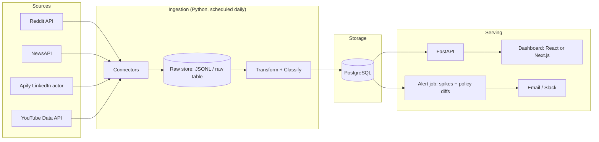

# SLD Intern Project Brief — Requirements & Design

**Project:** Social Listening Dashboard (SLD) for PainMed-PA / Probe Practice Solutions
**Audience:** PainMed-PA intern team (3–4 people)
**Owner / point of contact:** Srikar Sankranti
**Repo:** https://github.com/sankrantisrikar/SLD-Social-Listening-Dashboard
**Current live version:** https://social-listening-dashboard-final-sld.netlify.app
**Brief version:** 1.0 (Sep 14 2026)

> Read this document end to end before opening the code. Sections 1–4 are about the problem. Do not skip them to get to the architecture; the most common failure mode on this project so far has been building features before agreeing on what a useful "signal" is.

---

## 1. The problem we are solving

PainMed-PA provides revenue-cycle and prior-authorization services to U.S. **interventional pain management** practices. Those practices live or die by three things they cannot see well today:

1. **Payer behaviour.** UnitedHealthcare, Aetna, Cigna, BCBS plans, Humana and Medicare (CMS) change coverage rules, tighten prior-auth requirements and deny claims for specific procedures. Practices find out when denials spike, weeks after the fact.
2. **Procedure and device trends.** Spinal cord stimulation (SCS), SI joint fusion, kyphoplasty, Intracept (basivertebral nerve ablation), peripheral nerve stimulation (PNS), radiofrequency ablation (RFA), epidurals and facet injections each have their own reimbursement story. Which ones are getting harder to get paid for, and where?
3. **Policy shifts.** CMS programs (for example the WISeR prior-auth model), Local Coverage Determinations (LCDs) and payer clinical policy bulletins move the goalposts.

A lot of the early warning for all three shows up **in public conversation first**: physicians and billers venting on LinkedIn, patients and staff asking on Reddit (r/ChronicPain, r/medicalbilling, r/CodingandBilling), industry news, YouTube explainers, and posts on X.

**The product idea:** continuously listen to those public sources, classify what is being said (which payer, which procedure, which topic, what sentiment), and turn it into a weekly surveillance dashboard and alert stream that a practice CEO or RCM director can act on.

**The one-line value proposition:** *"Know what is happening in pain management before it hits your denials report."*

## 2. Who the users are

| Persona | What they need from SLD | How often | Success looks like |
|---|---|---|---|
| **Practice CEO / owner** | A 5-minute weekly read: top 5 signals, 3 risks, 3 opportunities. | Weekly | Reads the summary, forwards one item to the billing lead. |
| **RCM director / billing manager** (primary user) | Payer × procedure trend view, spike alerts, links to the original posts, ability to save keyword sets and watched authors. | Several times a week | Notices a UHC + SCS denial spike two weeks before it appears in their own AR. |
| **PainMed-PA account team** (internal) | Talking points for client calls, evidence for "this is an industry-wide payer issue, not your coding". | Weekly | Pulls a chart into a client deck. |
| **Compliance / policy watcher** | Notification when a payer policy page or CMS coverage page changes. | On change | Gets a diff, not a "something changed" ping. |

Interns: interview at least two real users (Srikar will arrange this) in week 1 and write down what they actually do today. The personas above are our guess, not the truth.

## 3. What exists today (v4.0, "Final SLD") and what is wrong with it

Read `README.md` at the repo root for the full version history. The short version:

**What works**
- A single-file dashboard (`pilot.html`) that fetches from five sources on demand: LinkedIn and X via Apify actors, Reddit via a proxy, YouTube Data API, NewsAPI.
- Rule-based classification of every post into a topic (Prior Auth, Billing & Denials, Payer Behavior, Procedures/Devices, Appeals & P2P, WISeR/CMS, General Pain), a payer, a procedure and a sentiment.
- Charts for topic volume, sentiment mix, platform mix, payer mentions and procedure mentions, plus top authors and a posts feed.
- A separate **Payer Policy Change Watch** page that hashes the text of watched policy URLs and reports changes.
- Deployed on Netlify with three serverless proxy functions (Reddit, News, policy watch) and a Flask equivalent for local use.

**What is wrong with it (be honest, this is the starting point, not a criticism)**
1. **Nothing persists.** Posts, credentials and monitors live in the browser's `localStorage`. Close the tab on another machine and there is no history, so there is no trend, only a snapshot.
2. **Nothing is scheduled.** A human must click "Fetch". "Weekly surveillance" is not possible without a scheduler.
3. **Classification is naive.** Sentiment is a 29-word list (`denied`, `approved`, …). Payer detection is substring match, so "united" inside any word matches UnitedHealth. Procedure detection matches `pns` inside "opns". Nobody has measured accuracy, so nobody knows how wrong it is.
4. **Credentials are handled in the browser.** API keys are typed into the page and stored client-side. Earlier copies of the code shipped with a real Apify token and a personal LinkedIn session cookie hard-coded in the HTML. That must never happen again.
5. **LinkedIn ingestion depends on a personal `li_at` cookie** fed to a third-party scraper. This is fragile (expires every 30–90 days), tied to one person's account, and sits in a grey area of LinkedIn's terms of service. It needs a deliberate decision, not an inherited default.
6. **No tests, no CI, no data model, no API.** All logic is inside one 2,500-line HTML file.
7. **No multi-user concept.** Every viewer sees whatever their own browser last fetched.

The Jan 6 technical design document (`docs/TECHNICAL_DESIGN_DOC_2026-01-06.md`) already described a proper pipeline: Python ETL → raw JSONL lake → PostgreSQL star schema → web dashboard. It was never built. Your job is, roughly, to build it, but only after you have checked that it is the right thing to build.

## 4. Questions you must answer before writing code

Spend the first week on these. Write the answers into `docs/DISCOVERY.md` and review them with Srikar before moving on.

1. **What is a "signal"?** Define, concretely, what event the dashboard should surface. Example candidates: "mentions of (payer P + procedure Q) in the last 7 days exceed 2× the trailing 8-week median". Pick a definition you can compute and a user can understand.
2. **Which sources are worth it?** For each of LinkedIn, Reddit, X, YouTube, News: how much relevant volume is there per week, what does it cost, is access permitted by the platform's terms, and how reliable is the access path? Produce a table. Be prepared to drop a source.
3. **What does the weekly artefact look like?** Sketch the CEO summary and the RCM view on paper before any UI code. Get a real user to react to the sketch.
4. **How will we know classification is good enough?** Decide the metric (precision/recall per class, or agreement with a human) and the threshold, and build the labelled evaluation set (see §7) before improving the classifier.
5. **What is out of scope?** Write the non-goals list (§5) in your own words and get it signed off.

## 5. Goals and non-goals for this intern phase

**Goals (10 weeks)**
- G1. A scheduled ingestion pipeline that collects from at least **three** sources daily without a human clicking anything.
- G2. Persistent storage with at least **8 weeks of history** by the end of the phase, so trends are real.
- G3. A classifier for topic, payer, procedure and sentiment with **measured** accuracy on a labelled set, and a documented improvement over the v4 rules.
- G4. A web dashboard that serves the RCM persona's weekly workflow, with the CEO summary as a second view.
- G5. Spike alerts and payer policy change alerts delivered by email (or Slack), with a link to the evidence.
- G6. Secrets held server-side only. A repo that can be public without leaking anything.
- G7. Tests, a README that lets the next intern cohort run it in under 30 minutes, and a recorded demo.

**Non-goals (explicitly not this phase)**
- Multi-tenant SaaS with billing, roles and per-client customisation.
- Scraping anything behind a login that is not permitted by that platform's terms.
- Ingesting any patient data or anything that could be PHI. This system touches only public posts.
- Real-time (sub-hour) monitoring. Daily is fine.
- Mobile app.
- Building our own NLP models from scratch. Use rules, off-the-shelf libraries or an LLM API.

## 6. Requirements

Priorities use MoSCoW: **M** must, **S** should, **C** could, **W** won't (this phase).

### 6.1 Functional

| ID | Requirement | Pri | Acceptance criterion |
|---|---|---|---|
| F1 | Scheduled ingestion from Reddit (search + selected subreddits) | M | Runs daily unattended; failures are logged and retried; duplicate posts are not stored twice. |
| F2 | Scheduled ingestion from a news source (NewsAPI or equivalent) | M | Same as F1. |
| F3 | Ingestion from LinkedIn via Apify using a **company-owned** account and server-side credentials, or a documented decision not to | M | Either daily runs with cost tracked per run, or a one-page decision memo signed off by Srikar. |
| F4 | Ingestion from YouTube (Data API) and X | S | Same as F1. X may be dropped after the §4 source review. |
| F5 | Raw payloads stored immutably before transformation | M | Every fetched item exists as raw JSON (file or table) with fetch timestamp, so it can be re-processed. |
| F6 | Normalised post table shared by all sources | M | One schema (§8) for every source; source-specific fields kept in a JSON column. |
| F7 | Classification: topic, payer(s), procedure(s), sentiment, physician-author flag | M | Every stored post has all five labels plus a confidence; classifier version recorded on each row. |
| F8 | Labelled evaluation set and evaluation script | M | ≥ 300 hand-labelled posts across sources; script prints per-class precision/recall; results tracked in the repo. |
| F9 | Dashboard: volume over time by topic / payer / procedure, sentiment mix, source mix, with date range and filters | M | RCM user can answer "is UHC + SCS getting worse this month?" in under one minute. |
| F10 | Dashboard: posts feed with link to original, author, source, labels; filterable | M | Every chart segment can be clicked through to the underlying posts. |
| F11 | Dashboard: CEO weekly summary (top signals, risks, opportunities) | S | Generated from data, not typed by hand; one screen; printable. |
| F12 | Spike detection and alerting (email or Slack) | M | Alert fires when a defined signal (§4 Q1) triggers; contains the metric, the baseline and 3 example posts. |
| F13 | Payer policy change watch with **text diff** | S | Watched URLs checked daily; alert shows what changed, not only that it changed. Reuse the v4 hashing idea; add diffing. |
| F14 | Saved keyword sets, saved watched authors/monitors (port from v3/v4) | S | Stored server-side per user. |
| F15 | CSV export of any filtered view | C | |
| F16 | AI assistant that answers questions over the stored posts with citations | C | Only after F1–F12 are done. Must cite post IDs; must refuse to answer outside the data. |
| F17 | Login for the dashboard | S | Simple shared login or email allow-list is enough. |

### 6.2 Non-functional

| ID | Requirement | Target |
|---|---|---|
| N1 | **Cost.** Total running cost of hosting, database and paid APIs | ≤ US$50 / month unless Srikar approves more. Track it weekly. |
| N2 | **Compliance.** No PHI, no private data, respect each platform's terms and robots rules | Source review in §4 documents the terms for each source; anything doubtful is escalated, not assumed. |
| N3 | **Secrets.** No credential in the repo, in the browser, or in logs | Secret scan in CI; `.env` only; server-side proxies for every keyed API. |
| N4 | **Reliability.** Daily job succeeds ≥ 95% of days; a failed source does not block other sources | Job status page or log; alert on two consecutive failures. |
| N5 | **Reproducibility.** Any post can be re-classified from raw | Classifier is a pure function of raw + version. |
| N6 | **Onboarding.** New developer running locally | ≤ 30 minutes following README, with a seed dataset so the UI is not empty. |
| N7 | **Quality.** Tests and CI | Unit tests for transformers and classifier; an end-to-end test that ingests a fixture and renders one chart's data. |

## 7. Classification plan

Start with rules, measure, then improve. Do not start with an LLM.

1. **Build the evaluation set first.** Sample ~300 posts across sources and topics from the existing v4 dashboard's data plus fresh fetches. Two interns label each post independently (topic, payers, procedures, sentiment, physician author yes/no). Measure inter-annotator agreement; where you disagree, write down the rule you agreed on. This becomes `data/eval/labels.csv` and the labelling guide becomes `docs/LABELLING_GUIDE.md`.
2. **Classifier v1 = the Jan 6 design doc's dictionaries, done properly.** Word-boundary regexes, not substring matches. Multi-label for payers and procedures (a post can mention UHC *and* Aetna). Physician flag from author title (`MD`, `DO`, `Dr.`, `Anesthesiologist`, `Pain Mgmt`…). Sentiment from VADER or a similar off-the-shelf lexicon, thresholds tuned on the eval set.
3. **Measure and report.** Per-class precision/recall in a table in the repo. This table is a deliverable.
4. **Classifier v2, only if v1 is not good enough.** Options in order of cost: better lexicons; a small fine-tuned or zero-shot transformer; an LLM API (Claude) with a strict JSON schema, rules as fallback, and cost per 1,000 posts recorded. Whichever you pick, keep v1 as the baseline and show the delta.
5. **Version every label.** Store `classifier_version` on each row so the dashboard can be re-run after improvements.

## 8. Target architecture

### 8.1 Recommended



- **Ingestion:** Python 3.11, one connector module per source, a single `run_daily.py` entry point. Schedule with GitHub Actions cron (free) or a Vercel/Netlify scheduled function. Keep it boring.
- **Raw store:** JSONL files in the repo's ignored `data/raw/{source}/{YYYY}/{MM}/{DD}/` locally, and a `raw_items` table (or object storage) in production. Never overwrite.
- **Database:** PostgreSQL on a free tier (Neon or Supabase). Star-ish schema in §8.3.
- **API:** FastAPI, read-only endpoints for the dashboard plus an admin endpoint to trigger a run.
- **Dashboard:** React (Vite) or Next.js with a charting library (Recharts or Chart.js, which v4 already uses). Port the v4 charts first so nothing is lost, then design the RCM and CEO views.
- **Alerts:** a second scheduled job that computes signals and sends email (Resend or SMTP) or Slack webhook.
- **Secrets:** `.env` locally, platform environment variables in production. Nothing in the browser.

### 8.2 Lighter alternative (if the team is front-end heavy)

Keep the static dashboard, add a scheduled Netlify/Vercel function that ingests into Supabase, and read from Supabase directly in the browser with row-level security. Fewer moving parts, but classification and alerting still need a scheduled server-side job, so you do not escape the pipeline. Choose this only if you can articulate why it beats 8.1 for our users.

### 8.3 Data model (starting point)

```
sources            (id, name, kind, terms_url, enabled)
raw_items          (id, source_id, external_id, fetched_at, payload JSONB)         -- immutable
posts              (id, source_id, external_id UNIQUE, url, author_name, author_title,
                    author_is_physician BOOL, text, title, posted_at, fetched_at,
                    likes, comments, shares, extra JSONB)
post_labels        (post_id, classifier_version, topic, sentiment, sentiment_score,
                    confidence, labelled_at)                                        -- one row per post per version
post_payers        (post_id, classifier_version, payer)                            -- multi-label
post_procedures    (post_id, classifier_version, procedure)                        -- multi-label
keyword_sets       (id, owner, name, keywords TEXT[])
monitors           (id, owner, source_id, handle_or_url, label)
policy_pages       (id, payer, url, label, added_by)
policy_snapshots   (id, policy_page_id, fetched_at, content_hash, text)
alerts             (id, kind, fired_at, metric, baseline, payload JSONB, sent_to)
eval_labels        (post_id, annotator, topic, payers, procedures, sentiment, physician)
```

Dictionaries (payers, procedures, topics) live in `config/taxonomy.yaml`, versioned with the classifier. Use the Jan 6 design doc's regex tables as the first draft.

## 9. Milestones (10 weeks)

The order matters: sources that are free and permitted first, so the pipeline exists before the hard source (LinkedIn) is decided.

| Week | Milestone | Deliverable that ends the week |
|---|---|---|
| 1 | Discovery | `docs/DISCOVERY.md` answering §4; two user interviews written up; paper sketches of the two views; source review table. |
| 2 | Evaluation set + pipeline skeleton | 300 labelled posts, labelling guide, agreement score; repo restructured (`ingestion/`, `api/`, `web/`, `config/`), CI with lint + secret scan. |
| 3 | Reddit + News ingestion to Postgres | Daily job running on a schedule; raw and normalised tables filling; job log visible. |
| 4 | Classifier v1 + evaluation report | Precision/recall table checked into the repo; `classifier_version` on every row. |
| 5 | API + dashboard MVP | RCM view: topic/payer/procedure volume over time, sentiment mix, posts feed with filters. Live URL. |
| 6 | LinkedIn decision + implementation | Decision memo. If yes: Apify connector with company account, server-side token, cost per run logged. YouTube connector. |
| 7 | Signals, alerts, policy watch | Spike definition implemented; first real alert email; policy page diffs. |
| 8 | CEO summary + hardening | CEO weekly view; tests; error handling; N1–N7 checked off; README rewritten. |
| 9 | User testing | Two users use it for a week; issues logged and the top five fixed. |
| 10 | Handoff | Recorded demo; `docs/HANDOFF.md`; backlog for the next cohort; retrospective. |

**Suggested split for 4 interns:** (a) ingestion + scheduling, (b) data model + classifier + evaluation, (c) API + dashboard, (d) alerts + policy watch + docs/QA. Rotate code review across pairs. For 3 interns, merge (a) and (d).

**Rituals:** 15-minute daily stand-up; Friday demo to Srikar (working software only, no slides); every PR reviewed by someone else.

## 10. Definition of done for the phase

- [ ] Daily ingestion has run unattended for at least 14 consecutive days on ≥ 3 sources.
- [ ] Database holds ≥ 8 weeks of posts (backfill is allowed where the source permits it).
- [ ] Evaluation report shows classifier v1 (and v2 if built) with per-class precision/recall, and beats the v4 rules on the same set.
- [ ] Dashboard is live, behind a login, and answers the RCM question in §6.1 F9 in under a minute.
- [ ] At least one spike alert and one policy-change alert have fired on real data and were judged useful by a user.
- [ ] Running cost for the last 30 days is documented and under budget.
- [ ] `git grep` for tokens/cookies finds nothing; CI secret scan is green.
- [ ] A new developer followed the README from zero to running dashboard in ≤ 30 minutes (test this with someone outside the team).
- [ ] Demo recorded; handoff doc and next-cohort backlog written.

## 11. Risks and open questions

| Risk | Likelihood | Mitigation |
|---|---|---|
| LinkedIn access via scraper is blocked, expensive, or judged non-compliant | High | Decide in week 6 with data from weeks 1–5; design so the product is useful without LinkedIn. |
| Reddit volume for niche payer × procedure combinations is too thin for spike detection | Medium | Widen to topic-level signals; use longer baselines; combine sources. |
| Classification accuracy is poor on short, sarcastic or jargon-heavy posts | Medium | Eval set first; confidence field; show low-confidence posts separately rather than hiding them. |
| Free-tier database or scheduler limits are hit | Low | Keep row counts modest (text only, no media); archive raw to object storage. |
| Scope creep toward the AI assistant before the pipeline is solid | High | F16 is gated on F1–F12; Srikar enforces. |

**Open questions for Srikar (interns: ask these in week 1):**
- Monthly budget ceiling and who owns the API accounts (Apify, NewsAPI, YouTube, Reddit app).
- Does PainMed-PA have, or can it create, a company LinkedIn account for ingestion?
- Which two real users can be interviewed, and can they receive alert emails during weeks 7–9?
- Which payers and procedures matter most to current clients? (This orders the taxonomy.)
- Email vs Slack for alerts.

## 12. Getting started (day 1)

1. Clone the repo and read `README.md` (version history and file map), then this document, then `docs/TECHNICAL_DESIGN_DOC_2026-01-06.md`.
2. Run v4 locally to see what exists:
   ```bash
   pip install -r requirements.txt
   python app.py        # http://localhost:5000
   ```
   Ask Srikar for a NewsAPI key and Reddit app credentials for local testing. Do not use anyone's personal LinkedIn cookie.
3. Skim `versions/02-intelligence-platform-2026-01-26/PRODUCT_BRIEF.md` and `versions/06-sld-hybrid-2026-02-24/PROJECT_UNDERSTANDING.md`; they show how the thinking evolved.
4. Look at the v4 classification code in `pilot.html` (`assignTopic`, `detectPayer`, `detectProcedure`, `analyzeSentiment`, around line 2,150). Note every way it can be wrong. That list seeds your labelling guide.
5. Book the two user interviews.
6. Create `docs/DISCOVERY.md` and start answering §4.

**Deliverables expected from the team, in order:** discovery doc → source review → labelled eval set + guide → architecture decision record (one page: what you chose from §8 and why) → working pipeline → evaluation report → dashboard → alerts → handoff.

---

*This brief is the starting point, not a contract. Push back on anything here that discovery proves wrong, in writing, and we will revise it together.*
