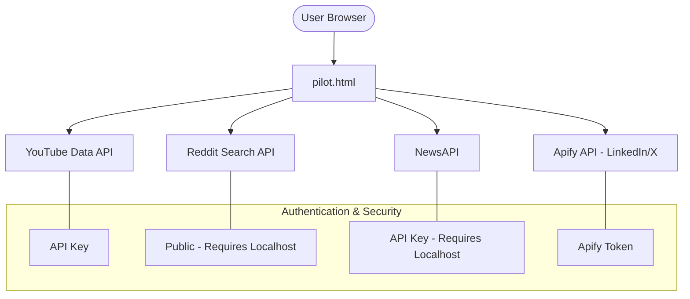

# PainMed-PA Dashboard: Architecture & Setup Guide

> [!NOTE]
> **Workspace Cleaned:** The primary functional dashboard is now located at `pilot.html`. Redundant backups have been removed to minimize confusion.
> **Twitter Search Fixed:** Removed restrictive exact-match quoting in the Twitter logic to improve fetch reliability on the Apify free tier.
> **LinkedIn Links Fixed:** Improved the LinkedIn URL construction logic to properly handle URNs and various metadata formats returned by the scraper.
> **Automated Protocol Skip:** Reddit and News are now automatically disabled and skipped when running via `file://` to prevent security errors.
> **Netlify Proxies Ready:** Prepared serverless functions for both **NewsAPI** and **Reddit** to enable them on public Netlify deployments.

This guide breaks down how the **Social Listening Dashboard** works and how to resolve the security restrictions that cause standard errors.

---

## 🌐 Deploying to Netlify (with Reddit & News)

To keep **Reddit** and **NewsAPI** working on your live site, follow these steps when you deploy to Netlify:

### 1. File Structure
Ensure your folder structure looks like this before uploading to Netlify:
```text
/                      (Root folder)
├── pilot.html         (Your dashboard)
└── netlify/
    └── functions/
        ├── news-proxy.js  (NewsAPI Proxy)
        └── reddit-proxy.js (Reddit Proxy)
```

### 2. How the Proxies Work
I've updated the fetch functions in `pilot.html` to detect their environment:
- **Local (localhost/file)**: They call the APIs directly.
- **Production (Netlify)**: They automatically route through `/.netlify/functions/...`.

### 3. Benefits
- ✅ **No Reddit CORS Errors**: The proxy handles the request server-side, bypassing browser CORS blocks.
- ✅ **No NewsAPI 426 Errors**: NewsAPI sees the request coming from a server, which is allowed on the free tier.

## 🏗️ Technical Architecture

The dashboard is a **serverless vanilla JavaScript application**. It consists of a single HTML file (`pilot.html`) that uses the browser's `fetch()` API to talk directly to external services.



## 🚨 Decoding the Errors

If you simply "double-click" the file, you will encounter these common errors:

| Error Code | Source | Cause | Solution |
| :--- | :--- | :--- | :--- |
| **403 Forbidden** | Apify | Invalid Token or missing credits. | Regenerate token in Apify. |
| **426 Upgrade Required** | NewsAPI | NewsAPI blocks requests from `file://`. | Run a local web server (localhost). |
| **CORS Error** | Reddit | Reddit blocks direct browser access from `file://`. | Run a local web server (localhost). |

---

## ✅ The "Proper" Setup (Mode: More Data)

To get **YouTube + Reddit + News** working simultaneously, follow these steps:

### 1. Launch a Local Server
Open your terminal, navigate to the project directory, and run:
```bash
python3 -m http.server 8080
```

### 2. Access the Dashboard
Do **not** double-click the file. Open your browser and go to:
[http://localhost:8080/pilot.html](http://localhost:8080/pilot.html)

### 3. Add Credentials
1. Click the **⚙️ Credentials** button.
2. Enter your **YouTube API Key** (from Google Cloud).
3. Enter your **NewsAPI Key** (from newsapi.org).
4. **Save** and click **Fetch & Analyze**.

---

## 💡 Key Design Patterns
- **LocalStorage Persistence**: Your API keys are stored only in your browser's local storage—never on a server.
- **Parallel Processing**: The dashboard fetches from multiple sources at the same time to reduce wait times.
- **Zero Frameworks**: Built with pure HTML5/JS and Chart.js for maximum performance and portability.

---

## 🛠️ Recommended Path Forward
1. **Start with YouTube only**: It has the most reliable data and doesn't require a server.
2. **Add Reddit/News**: Once you are comfortable, use the `python3` command above to unlock these sources.
3. **LinkedIn/X**: Use only if you have an active Apify paid plan or remaining $5 monthly credits.
